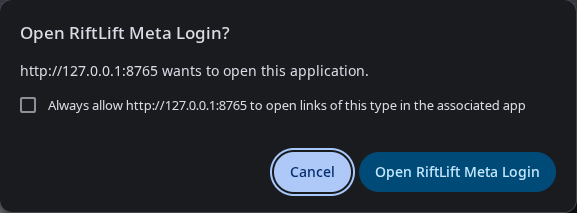
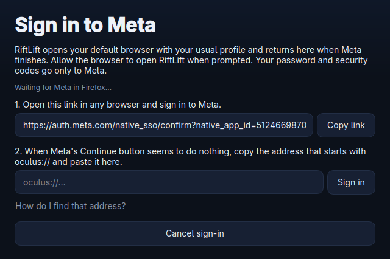
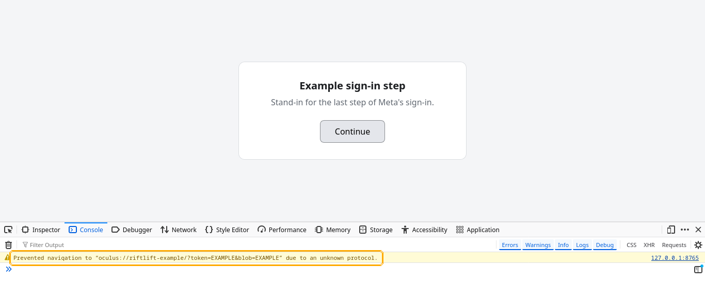

# Signing in manually

RiftLift normally signs you in through your default browser. Meta finishes by
sending the browser to an address that starts with `oculus://`, and RiftLift
receives that address.

## When the browser asks

After you click **Continue as …** on Meta's page, your browser may ask whether
it may open **RiftLift Meta Login**. Allow it, and RiftLift finishes the
sign-in by itself.

## When nothing happens

Sometimes nothing receives the address:

- RiftLift says **No default browser was found**.
- You clicked **Continue as …** on Meta's page and nothing happened.
- You want to sign in with a browser other than your default one.

Then sign in manually. Use **Firefox** for it: it shows the `oculus://` address
in its console. Chrome and Chromium don't show it anywhere.

### 1. Open the sign-in link

In RiftLift's sign-in window, click **Sign in manually** (it is already open when
RiftLift couldn't start a browser). Click **Copy link**, paste the link into
Firefox, and sign in to Meta as usual.

### 2. Copy the oculus:// address

1. On Meta's last page, **Continue as …**, press **Ctrl+Shift+K**. Firefox's
   **Web Console** opens.
2. Click **Continue**. A yellow message appears: *Prevented navigation to
   "oculus://…" due to an unknown protocol.*
3. Right-click the message and choose **Copy Message**, or select it and copy
   it with **Ctrl+C**.

If you clicked **Continue** before opening the console, just click it again.

### 3. Paste it into RiftLift

Back in RiftLift, paste into the field under step 2 and click **Sign in**. You
can paste the whole console message: RiftLift picks out the `oculus://` address.

## Keep the address to yourself

The `oculus://` address signs in your Meta account. Paste it only into RiftLift
and never share it or post it in a screenshot. It works only once, and only for
the sign-in RiftLift is waiting for, so if something goes wrong, start a new
sign-in instead of reusing an old address.

The screenshots above show a stand-in page with example values, not a real
sign-in.
